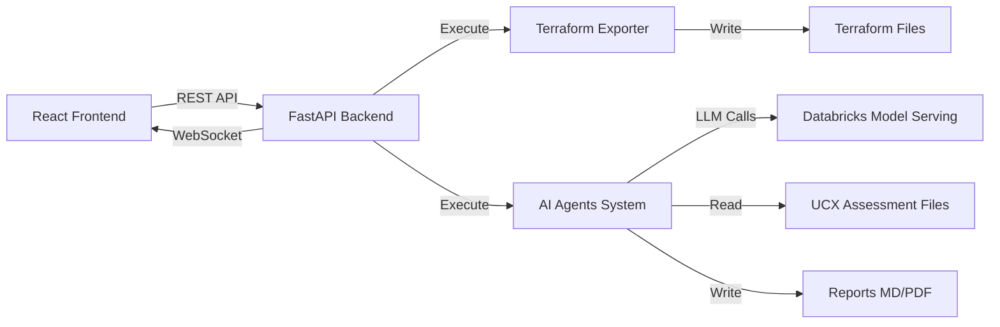

# Databricks Assessment Tool

🚀 **Ferramenta web completa para análise automatizada de infraestrutura Databricks usando Terraform Export + AI Multi-Agent System**

   

---

## 📋 Índice

- [Visão Geral](#-visão-geral)
- [Arquitetura](#-arquitetura)
- [Estrutura do Projeto](#-estrutura-do-projeto)
- [Instalação](#-instalação)
- [Como Rodar Localmente](#-como-rodar-localmente)
- [AI Multi-Agent System](#-ai-multi-agent-system)
- [Configuração](#-configuração)
- [Troubleshooting](#-troubleshooting)

---

## 🎯 Visão Geral

Ferramenta web interativa para:
- **Exportar** infraestrutura Databricks completa para Terraform
- **Analisar** recursos usando AI Multi-Agent System (4 agentes especializados)
- **Processar** assessments de migração Unity Catalog (UCX)
- **Gerar** relatórios executivos com recomendações

### 🌟 Principais Funcionalidades

✅ **Interface Web Moderna** - React + Material-UI  
✅ **API REST** - FastAPI com WebSocket para feedback em tempo real  
✅ **Terraform Export** - Databricks Provider v1.91.0  
✅ **4 AI Agents** - Terraform Reader, Databricks Specialist, UCX Analyst, Report Generator  
✅ **UCX Integration** - Análise de assessments de migração Unity Catalog  
✅ **PDF Export** - Relatórios profissionais com WeasyPrint  
✅ **Dynamic Agent Management** - Criação e seleção dinâmica de agentes  

---

## 🏗️ Arquitetura



### Componentes

**Frontend (React 18 + Vite + MUI)**
- 5 Steps Wizard (Configuration, Agents, UCX Upload, Execution, Results)
- Real-time execution monitoring via WebSocket
- Dynamic agent configuration
- HTML report viewer with PDF export

**Backend (FastAPI + Python 3.13)**
- REST API endpoints for configuration, agents, execution
- WebSocket for real-time feedback
- Python executors (Terraform Export + AI Agents)
- PDF generation with WeasyPrint

**AI Agents (CrewAI + Databricks LLM)**
- Dynamic agent registry
- 4 specialized agents (extendable)
- Databricks Claude Sonnet 4.5 via Model Serving
- Context-aware report generation

**Storage (Local)**
- UCX assessment files in `ucx_export/`
- Exported Terraform files in `databricks_tf_files/`
- Generated reports in `output_summary_agent/`

---

## 📁 Estrutura do Projeto

```
databricks-assessment-tool/
├── .env                                # Configurações (gitignored)
├── .env.example                        # Template de configuração
├── .gitignore
├── README.md                           # Este arquivo
├── run_app.sh                          # 🚀 Script principal (roda tudo)
│
├── databricks_app/                     # ✨ Web Application
│   ├── start.sh                        # Backend startup script
│   │
│   ├── backend/                        # 🐍 FastAPI Backend
│   │   ├── main.py                     # API endpoints
│   │   ├── executors.py                # Terraform & AI executors
│   │   ├── execution_manager.py        # State management
│   │   ├── pdf_generator.py            # Markdown to PDF
│   │   ├── requirements.txt
│   │   └── venv/                       # Python virtual environment
│   │
│   └── frontend/                       # ⚛️ React Frontend
│       ├── src/
│       │   ├── App.jsx                 # Main app component
│       │   └── components/
│       │       ├── ConfigurationStep.jsx
│       │       ├── AgentsStep.jsx
│       │       ├── UCXUploadStep.jsx
│       │       ├── ExecutionStep.jsx
│       │       └── ResultsStep.jsx
│       ├── index.html
│       ├── vite.config.js
│       ├── package.json
│       └── node_modules/
│
├── databricks_summary_agent/           # 🤖 AI Agents System
│   ├── src/terraform_file_summary_agent/
│   │   ├── crew.py                     # CrewAI configuration
│   │   ├── main.py                     # Agents entry point
│   │   ├── agent_registry.py           # Dynamic agent management
│   │   ├── terraform_summarizer.py     # Terraform analysis tool
│   │   ├── config/
│   │   │   ├── agents.yaml             # Agents definitions
│   │   │   └── tasks.yaml              # Tasks definitions
│   │   └── tools/
│   │       ├── terraform_summary_tool.py
│   │       └── ucx_analyzer_tool.py    # UCX assessment analyzer
│   ├── pyproject.toml
│   └── uv.lock
│
├── databricks_tf_files/                # 📦 Terraform Export Output
│   ├── *.tf                            # Generated Terraform files
│   ├── notebooks/                      # Exported notebooks
│   ├── exporter-run-stats.json
│   └── ignored_resources.txt
│
├── ucx_export/                         # 📊 UCX Assessment Files
│   └── *.xlsx                          # UCX assessment spreadsheets
│
└── output_summary_agent/               # 📄 Generated Reports
    ├── Databricks_Assessment_Report.md # Consolidated report
    ├── UCX_Migration_Assessment.md     # UCX-specific report
    └── *.md                            # Individual agent reports
```

---

## 🛠️ Instalação

### Pré-requisitos

- **Python 3.13+**
- **Node.js 18+** e npm
- **UV** (Python package manager): `brew install uv` ou `pip install uv`
- **Terraform** (opcional, usa binário local)

### 1. Clone o Repositório

```bash
git clone <repository-url>
cd databricks-assessment-tool
```

### 2. Configurar Variáveis de Ambiente

```bash
cp .env.example .env
nano .env
```

Edite com suas credenciais:

```bash
# Databricks
DATABRICKS_HOST=https://your-workspace.cloud.databricks.com/
DATABRICKS_TOKEN=dapiXXXXXXXXXXXXXXXXXXXXXXXX
DATABRICKS_ENDPOINT=/serving-endpoints/databricks-claude-sonnet-4-5/invocations

# Application Ports
BACKEND_PORT=8002
FRONTEND_PORT=3002

# Storage
TF_FILES_DIR=databricks_tf_files
OUTPUT_DIR=output_summary_agent
UCX_DIR=ucx_export
```

### 3. Instalar Dependências

**Backend:**
```bash
cd databricks_app/backend
python3 -m venv venv
source venv/bin/activate
pip install -r requirements.txt
```

**Frontend:**
```bash
cd databricks_app/frontend
npm install
```

**AI Agents:**
```bash
cd databricks_summary_agent
uv sync
```

---

## 🚀 Como Rodar Localmente

### Opção 1: Backend + Frontend Separados

**Terminal 1 - Backend:**
```bash
cd databricks_app/backend
source venv/bin/activate
uvicorn main:app --host 0.0.0.0 --port 8002 --reload
```

**Terminal 2 - Frontend:**
```bash
cd databricks_app/frontend
npm run dev
```

Acesse: `http://localhost:3002`

### Opção 2: Script Automatizado (Produção)

```bash
./run_app.sh
```

### ⏱️ Tempo de Execução (Medido)

Tempos reais medidos em workspace de produção:

- **Terraform Export**: ~15 minutos (depende do número de recursos)
- **AI Agents Analysis**: ~22 minutos (4 agentes, 4 reports)
- **Total (end-to-end)**: **~37 minutos**

*Nota: Medido em workspace com 34 arquivos Terraform e 3 arquivos UCX. Tempos variam conforme tamanho do workspace e número de agentes selecionados.*

---

## 🤖 AI Multi-Agent System

### Agentes Disponíveis

#### 1️⃣ Terraform Analysis Expert
- **Role**: Especialista em análise de infraestrutura as code
- **Task**: Ler e analisar arquivos Terraform exportados
- **Tool**: `TerraformSummaryTool` (token-optimized)
- **Output**: Estrutura, recursos, configurações

#### 2️⃣ Databricks Optimization Specialist
- **Role**: Especialista em otimização Databricks
- **Task**: Identificar problemas de segurança, performance e custos
- **Tools**: Context from Terraform Reader
- **Output**: Recomendações priorizadas

#### 3️⃣ Unity Catalog Migration (UCX) Analyst
- **Role**: Especialista em migração Unity Catalog
- **Task**: Analisar assessments UCX e identificar blockers
- **Tool**: `UCXAnalyzerTool` (Excel/CSV processor)
- **Output**: Migration readiness assessment

#### 4️⃣ Technical Documentation Specialist (Report Generator)
- **Role**: Gerador de relatórios executivos
- **Task**: Consolidar análises em um relatório profissional
- **Tools**: `FileWriterTool` + context from all agents
- **Output**: Databricks_Assessment_Report.md

### LLM Configuration

- **Provider**: Databricks Model Serving
- **Model**: Claude Sonnet 4.5
- **Endpoint**: `/serving-endpoints/databricks-claude-sonnet-4-5/invocations`
- **Library**: LiteLLM (unified interface)

### Criando Novos Agentes

1. Adicione no `config/agents.yaml`
2. Adicione task correspondente em `config/tasks.yaml`
3. (Opcional) Crie tool customizada em `tools/`
4. Agente será automaticamente disponível na UI!

---

## ⚙️ Configuração

### Arquivo .env

Todas as configurações centralizadas em `.env`:

```bash
# Databricks Configuration
DATABRICKS_HOST=<workspace-url>
DATABRICKS_TOKEN=<token>
DATABRICKS_ENDPOINT=<llm-endpoint>

# Terraform Configuration
TERRAFORM_PATH=                         # Optional, uses PATH if empty
TF_FILES_DIR=databricks_tf_files

# AI Agents Configuration  
OUTPUT_DIR=output_summary_agent
UCX_DIR=ucx_export
SELECTED_AGENTS=                        # Empty = all agents

# Application Ports
BACKEND_PORT=8002
FRONTEND_PORT=3002

# Advanced Settings
LOG_LEVEL=INFO
DEBUG_MODE=false
```

### Terraform Export Options

Configurável via UI:
- **Services**: compute, jobs, notebooks, sql-endpoints, uc-*, etc.
- **Listing**: recursos para listar e importar dependências
- **Debug Mode**: logs detalhados

### AI Agents Selection

Selecione quais agentes executar:
- ☑️ Terraform Analysis Expert
- ☑️ Databricks Optimization Specialist
- ☑️ Unity Catalog Migration (UCX) Analyst
- ☑️ Technical Documentation Specialist

### 🔧 Mudando as Portas (Opcional)

Se as portas padrão (8002/3002) estiverem em uso, edite o `.env`:

```bash
# Application Ports
BACKEND_PORT=9000   # Mude para a porta desejada
FRONTEND_PORT=4000  # Mude para a porta desejada
```

Depois, rode normalmente:
```bash
./run_app.sh
```

O script vai automaticamente usar as novas portas! ✨

**Nota**: O frontend (Vite) também precisa ser configurado. Edite `databricks_app/frontend/vite.config.js` se necessário.

---

## 🐛 Troubleshooting

### Backend não inicia

```bash
# Verificar porta
lsof -i :8002

# Recriar virtual environment
cd databricks_app/backend
rm -rf venv
python3 -m venv venv
source venv/bin/activate
pip install -r requirements.txt
```

### Frontend não inicia

```bash
# Limpar cache e reinstalar
cd databricks_app/frontend
rm -rf node_modules package-lock.json
npm install
npm run dev
```

### Erro: "DATABRICKS_HOST not configured"

Verifique se o `.env` está no **root do projeto** (não no databricks_app/)

### Erro: "Rate Limit Exceeded"

O sistema já otimiza tokens (redução de 99%), mas se ainda ocorrer:
- Reduza número de arquivos Terraform no export
- Aguarde alguns minutos (rate limit por minuto)
- Verifique seu tier de FMAPI no Databricks

### Erro: "WeasyPrint not installed"

```bash
cd databricks_app/backend
source venv/bin/activate
pip install weasyprint
```

### Reports não aparecem no frontend

1. Verifique se `output_summary_agent/*.md` existem
2. Check backend logs: `cat databricks_app/backend/logs/*.log`
3. Teste endpoint: `curl http://localhost:8002/api/results/list`

### Permission errors

Verifique se o token tem permissões adequadas para:
- Ler recursos do workspace
- Executar Terraform export
- Acessar arquivos UCX

---

## 📚 Recursos

- [Databricks Terraform Provider](https://registry.terraform.io/providers/databricks/databricks/latest/docs)
- [Databricks Model Serving](https://docs.databricks.com/en/machine-learning/model-serving/index.html)
- [CrewAI Documentation](https://docs.crewai.com/)
- [FastAPI Documentation](https://fastapi.tiangolo.com/)
- [React Documentation](https://react.dev/)

---

## 🤝 Contribuindo

Contribuições são bem-vindas! Este é um projeto open-source para automação de assessments Databricks.

---

## 📄 Licença

MIT License - Open Source

---

**Última atualização**: 17 de Outubro de 2025  
**Versão**: 1.0.0  
**Maintainer**: Rodrigo
